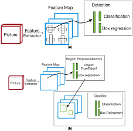

# Region proposal network

This is a repository implementing Region Proposal Network from scratch using Pytorch

## Introduction

Region Proposal Network (RPN) is one of two stages object detection which RPN is the first stage. Two-stage detectors
consists of two stages. First stage is used to sugges the region of interest (region where is the object in) and then
these region proposals are sent to the next network(stage two) for object classification and offset regression.

The input of RPN is feature map given by the backbone network(like: VGG-16, Resnet, in this project we use VGG-16). We
output 512 channel and then fed into 1x1 sibling convolutional layer for classification and offset regression.

<div align="center">



</div>

## Project Structures

<strong>configs</strong>: project's config file. You can change project's config to be suitable with your goal.

<strong>data</strong>: contains data. For object detection task data contains 2 folders including images and
annotations.

<strong>data_loaders</strong>: Load data utils

<strong>losses</strong>: Custom loss functions

<strong>models</strong>: Model architecture include backbones.

<strong>metrics</strong>: Custom metrics

<strong>saved</strong>: Folder contains log and checkpoint files

<strong>trained</strong>: Conduct to train model

<strong>utils</strong>: Folder contains utils like: anchor box generatio, convert to some box format, read annotation...

<em>Note: You can custom your own model architecture, loss, metric, data_loader... Just create python files which are
written class types and place these in folders respectively, then change the config file with the name is class's
name.</em>

## Run

### Install necessary packages

If you have not installed anaconda yet. Lets download and install by
clicking [here](https://docs.anaconda.com/anaconda/install/index.html)

```
conda env --name fpn
conda activate fpn
pip install -r requirements.txt
```

Store dataset in folder data with 2 sub- folder are: images and annotations. You can store at other folders. But you
must change data path at config file.

#### Train

```
python run train.py -c configs/config.json
```

#### Test

```
python run test.py -c configs/config.json
```

#### Inference

```
python run test.py -c -c configs/config.json -r saved/models/detection/1215_114939/model_best.pth
```

<em>Make sure you are in root folder in advance running.</em>
